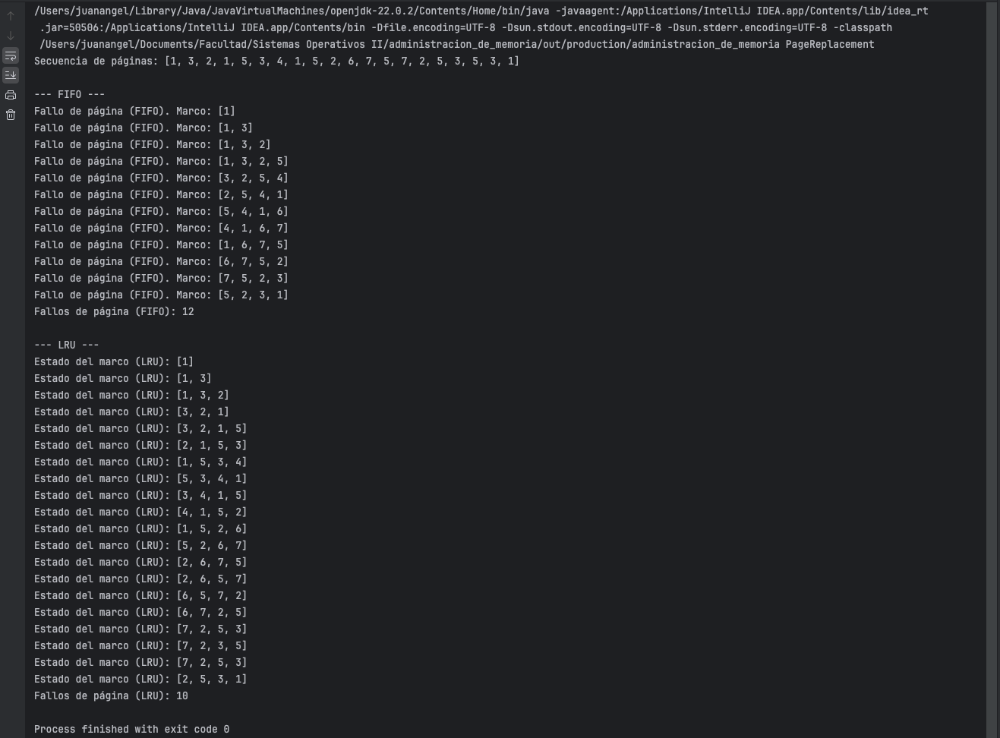

### Implementación de Algoritmos de Reemplazo de Páginas (FIFO y LRU)

---

## 1. Descripción Algorítmica

### **Algoritmo FIFO (First-In-First-Out):**
- **Propósito**: Maneja la memoria reemplazando la página más antigua en el marco cuando ocurre un fallo.
- **Descripción**:
    1. Se utiliza una **cola** (estructura FIFO) para manejar las páginas cargadas en memoria.
    2. Cada vez que una página nueva ingresa:
        - Si no está en la cola y el marco está lleno, se elimina la página más antigua.
        - Se agrega la nueva página a la cola.
        - Se registra un fallo de página.
    3. Si la página ya está en la cola, no se hace ningún cambio.

### **Algoritmo LRU (Least Recently Used):**
- **Propósito**: Reemplaza la página que no ha sido utilizada durante más tiempo.
- **Descripción**:
    1. Se utiliza una **lista** para almacenar las páginas cargadas en memoria, ordenadas por uso reciente.
    2. Cada vez que una página nueva ingresa:
        - Si no está en la lista y el marco está lleno, se elimina la página en la posición inicial (menos recientemente usada).
        - Se agrega la nueva página al final de la lista.
        - Se registra un fallo de página.
    3. Si la página ya está en la lista, se elimina y se vuelve a agregar al final para actualizar su uso.

---

## 2. Casos de Prueba

### Caso de Prueba 1: Secuencia Simple
- **Entrada**:
    - Secuencia de páginas: `1, 3, 2, 1, 5, 3, 4, 1, 5, 2, 6, 7, 5, 7, 2, 5, 3, 5, 3, 1`
    - Tamaño del marco: `4`

- **Resultado Esperado**:
    - **FIFO**: 12 fallos de página.
    - **LRU**: 10 fallos de página.

---

## 3. Descripción del Entorno de Desarrollo

### **Requisitos del Sistema**
- **Sistema Operativo**: Windows 10/11, macOS.
- **Entorno de Desarrollo**:
    - **IDE**: IntelliJ IDEA, Eclipse o NetBeans (opcional).
    - **Compilador**: JDK 22 (Java Development Kit) instalado.
- **Archivo de Entrada**:
    - Archivo CSV con el formato: `1,3,2,1,5,3,4,1,5,2,6,7,5,7,2,5,3,5,3,1`

### **Pasos para Reproducir la Ejecución**:
1. Crear un archivo CSV con la secuencia de páginas.
2. Configurar la variable `filePath` con la ruta del archivo.
3. Compilar el programa con el comando:
   ```bash
   javac PageReplacement.java
   ```
4. Ejecutar el programa:
   ```bash
   java PageReplacement
   ```
5. Observar los resultados impresos para los algoritmos FIFO y LRU.

---

## 4. Lenguaje y Versiones
- **Lenguaje**: Java
- **Versión**: Java 22.

---

## 5. Bibliotecas Utilizadas
- **Bibliotecas Estándar de Java**:
    - `java.io.*`: Para lectura del archivo CSV.
    - `java.util.*`: Para las estructuras de datos:
        - `Queue` (FIFO)
        - `ArrayList` (LRU)

**No se requiere ninguna biblioteca externa** más allá de las incluidas en el JDK.

## 6. Ejecucion exitosa



